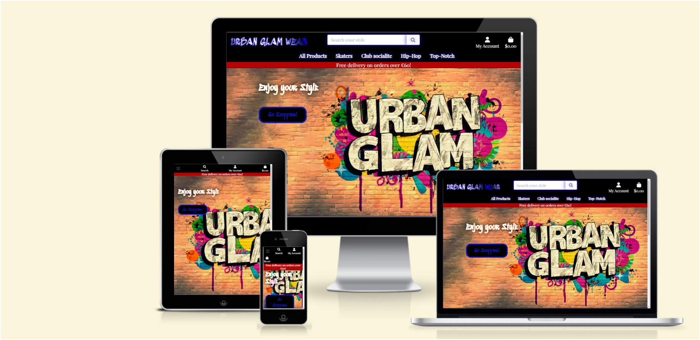
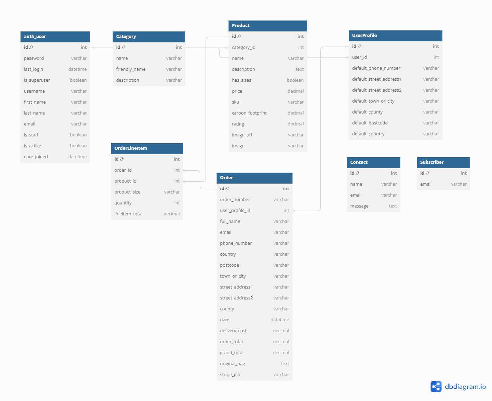
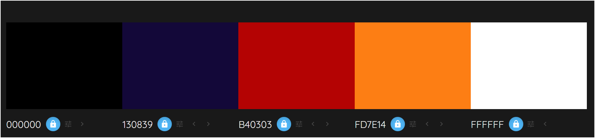
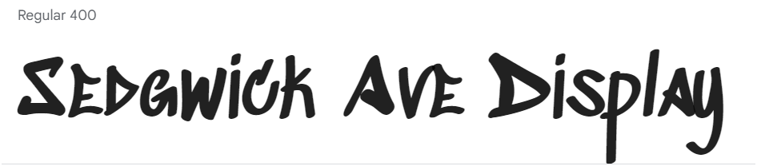

# URBAN GLAM WEAR

## Introduction
[Link to deployed site](https://book-heaven-e537b3f88787.herokuapp.com/)
Urban Glam Wear is an online clothes shopping site designed for urban fashionist and created using Django, Python, HTML, CSS JavaScript, Amazon Web Services and Stripe.

## Table of Contents

- [URBAN GLAM WEAR](#urban-glam-wear)
    - [Introduction](#introduction)
    - [Table of Contents](#table-of-contents)
    - [User Experience (UX)](#user-experience-ux)
        - [Project Goals](#project-goals)
        - [User Stories](#user-stories)
        - [Strategy Table](#strategy-table)
    - [Scope](#scope)
        - [Phase 1](#phase-1)
        - [Phase 2](#phase-2)
        - [Phase 3](#phase-3)
        - [Phase 4](#phase-4)
    - [Structure](#structure)
        - [Database Model](#database-model)
        - [Colour Scheme](#colour-scheme)
        - [Typography](#typography)
        - [Wireframes](#wireframes)
    - [Features](#features)
        - [General](#general)
        - [Home Page](#home-page)
        - [Register Page](#register-page)
        - [My Profile Page](#my-profile-page)
        - [Login & Logout Pages](#login--logout-pages)
        - [Wishlist Page](#wishlist-page)
        - [Product Management](#product-management)
        - [Products Page](#products-page)
        - [Product Detail Page](#product-detail-page)
        - [Bag Page](#bag-page)
        - [Checkout Page](#checkout-page)
        - [Contact Us Page](#contact-us-page)
        - [About Us Page](#about-us-page)
        - [Privacy Policy Page](#privacy-policy-page)
        - [404 Page](#404-page)
    - [Technologies Used](#technologies-used)
        - [Languages Used](#languages-used)
        - [Frameworks, Libraries and Programs Used](#frameworks-libraries-and-programs-used)
        - [Packages / Dependencies Installed](#packages--dependencies-installed)
    - [Testing](#testing)
        - [Code Validation](#code-validation)
            - [HTML](#html)
            - [CSS](#css)
            - [Python](#python)
        - [Accesibility](#accesibility)
        - [Tools Testing](#tools-testing)
        - [Manual Testing](#manual-testing)
            - [Browser Compatibility](#browser-compatibility)
            - [Device Compatibility](#device-compatibility)
            - [Navbar Testing](#navbar-testing)
            - [Footer Testing](#footer-testing)
            - [Search Bar Testing](#search-bar-testing)
            - [Product Page Testing](#product-page-testing)
            - [Product Detail Page Testing](#product-detail-page-testing)
            - [Bag Testing](#bag-testing)
            - [Checkout Page Testing](#checkout-page-testing)
            - [Contact Us Page Testing](#contact-us-page-testing)
            - [Privacy Policy Page Testing](#privacy-policy-page-testing)
            - [404 Page Testing](#404-page-testing)
            - [Register Page Testing](#register-page-testing)
            - [Login Page Testing](#login-page-testing)
            - [Logout Page Testing](#logout-page-testing)
            - [Product Management Page Testing](#product-management-page-testing)
            - [Wishlist Page Testing](#wishlist-page-testing)
    - [Deployment](#deployment)
        - [Deploying on Heroku](#deploying-on-heroku)
    - [Credits](#credits)
        - [Content](#content)
        - [Media](#media)
        - [Code](#code)
    - [Known Bugs](#known-bugs)
    - [Acknowledgements](#acknowledgements)

## User Experience (UX)

Not all Customers enjoy a day of shopping in a crowded mall. Other customers do not have the time or means to go shopping in a physical store. Many customers enjoy searching for their favorite clothes online without having to leave their home. This Website is for all of them.

### Project Goals

- Responsive design to make the website accessible on different screen sizes.
- Well-structured website and easy to navigate.
- Provide security in access to user data and their bookings.
- Provide a search bar and a navbar to allow the users to look for products by categories.
- Allows CRUD functionality in bag page and product management page.
- Provide users with a secure checkout system.

### User Stories

- USER STORIE 1: As a shopper, I can browse a list of available products so that I can explore the offerings and find items of interest.
- USER STORIE 2: As a shopper, I can apply filters to products by category, price, and features so that I can narrow down my search and find products that meet my preferences.
- USER STORIE 3: As a shopper, I can view detailed product information, including images and descriptions, so that I can make informed decisions about my purchases.
- USER STORIE 4: As a shopper, I can add products to my shopping cart so that I can keep track of items I intend to purchase.
- USER STORIE 5: As a shopper, I can view and edit the contents of my shopping cart so that I can make adjustments before finalizing my purchase.
- USER STORIE 6: As a shopper, I want to receive a confirmation email after making a purchase so that I have a record of my transaction.
- USER STORIE 7: As a registered user, I can create an account so that I can track my order history.
- USER STORIE 8: As a registered user I can edit my shipping/billing information and my contact information so that update my information in my profile.
- USER STORIE 9: As a shopper, I can review my order summary during the checkout process so that I can confirm the accuracy of my selected items and their quantities.
- USER STORIE 10: As an administrator, I can manage the product catalog by adding, editing, or removing products so that the website reflects the current inventory.
- USER STORIE 11: As an administrator, I can receive email notifications about new orders so that I can stay informed about incoming business.
- USER STORIE 12: As a User I can Enter my payment information so that Check out easily and with no problems.
- USER STORIE 13: As a User I can add products to my wish list so that I can save my favorite items for a future purchase.
- USER STORIE 14: As a User I can receive a newsletter so that I can be updated about all the discounts and arrivals.
- USER STORIE 15: As a User I can use a contact form so that I can make questions about products, discounts and other topics of my interest.

### Strategy Table

Opportunity/Problem/Feature| Importance| Viability/Feasibility
------------ | -------------------------|---------
Responsive design | 5 | 5
Display Products in a list | 5 | 5
Account registration | 5 | 5
User profile | 5 | 5
Admin Product Management | 5 | 5
Add products to bag | 5 | 5
Remove products from bag | 5 | 5
Update products in the bag | 5 | 5
Provides a checkout page | 5 | 5 
Contact form | 3 | 4
wishlist | 3 | 4 
Newsletter Subscription | 3 | 3
Avoid double checkout | 5 | 4
checkout email | 3 | 3
Total | 62 | 63

## Scope

### Phase 1
- Responsive design
- Display products in a list
- Add products to bag
- Remove products from bag
- Update products in bag
### Phase 2
- Account registration
- User profile
- Admin product management
- Provides a checkout page
### Phase 3
- Avoid double checkout
- Checkout email
### Phase 4
- Wishlist
- Newsletter subscription
- Contact form
## Structure
### Database Model

### Colour Scheme

### Typography
The Website has been created with 2 fonts. The main one is Playfair display.
For Titles and Branding the choosen font is Sedgwick Ave Display.

### Wireframes

[Balsamiq](https://balsamiq.com/) has been used to create all the wireframes for desktop and mobile views for this project.

Page | Wireframe
--- | ---

