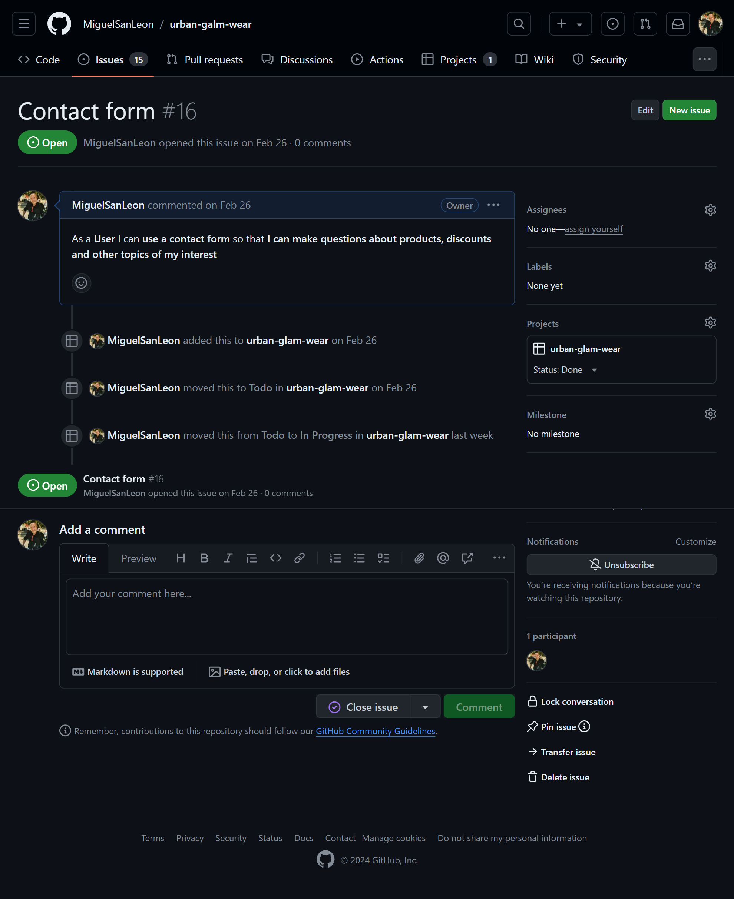
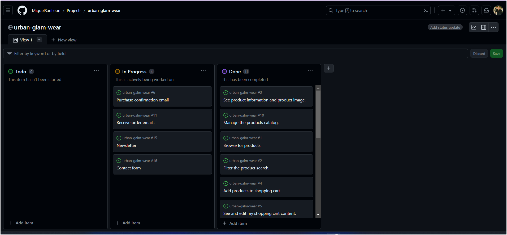

# URBAN GLAM WEAR


## Introduction
[Link to deployed site](https://urban-glam-wear-e8c11a4943c2.herokuapp.com/)
Urban Glam Wear is an online clothes shopping site designed for urban fashionists and created using Django, Python, HTML, CSS JavaScript, Amazon Web Services, and Stripe.


## Table of Contents


- [URBAN GLAM WEAR](#urban-glam-wear)
    - [Introduction](#introduction)
    - [Table of Contents](#table-of-contents)
    - [User Experience (UX)](#user-experience-ux)
        - [Project Goals](#project-goals)
        - [User Stories](#user-stories)
        - [Strategy Table](#strategy-table)
    - [Scope](#scope)
        - [Phase 1](#phase-1)
        - [Phase 2](#phase-2)
        - [Phase 3](#phase-3)
        - [Phase 4](#phase-4)
    - [Structure](#structure)
        - [Database Model](#database-model)
        - [Colour Scheme](#colour-scheme)
        - [Typography](#typography)
        - [Wireframes](#wireframes)
        - [Agile Methodology](#Agile-Methodology)
            - [Overview](#overview)
            - [User Stories issues](#user-stories-issues)
            - [GitHub Projects](#github-projects)
    - [Features](#features)
        - [General](#general)
        - [Home Page](#home-page)
        - [Register Page](#register-page)
        - [My Profile Page](#my-profile-page)
        - [Login & Logout Pages](#login--logout-pages)
        - [Wishlist Page](#wishlist-page)
        - [Product Management](#product-management)
        - [Products Page](#products-page)
        - [Product Detail Page](#product-detail-page)
        - [Bag Page](#bag-page)
        - [Checkout Page](#checkout-page)
        - [Checkout Success Page](#checkout-success-page)
        - [Contact Us Page](#contact-us-page)
        - [About Us Page](#about-us-page)
        - [Privacy Policy Page](#privacy-policy-page)
        - [404 Page](#404-page)
    - [Search Engine Optimization SEO and Marketing](#search-engine-optimization-seo-and-marketing)
        - [Business Model](#business-model)
        - [SEO](#seo)
    - [Marketing](#marketing)
    - [Technologies Used](#technologies-used)
        - [Languages Used](#languages-used)
        - [Frameworks, Libraries and Programs Used](#frameworks-libraries-and-programs-used)
        - [Packages / Dependencies Installed](#packages--dependencies-installed)
        - [Technologies and programs](#technologies-and-programs)
    - [Testing](#testing)
    - [Deployment](#deployment)
        - [Stripe Setup](#stripe-setup)
        - [AWS Setup](#aws-setup)
        - [Deploying on Heroku](#deploying-on-heroku)
    - [Credits](#credits)
        - [Content](#content)
        - [Media](#media)
        - [Code](#code)
    - [Known Bugs](#known-bugs)
    - [Acknowledgements](#acknowledgements)


## User Experience (UX)


Not all Customers enjoy a day of shopping in a crowded mall. Other customers do not have the time or means to go shopping in a physical store. Many customers enjoy searching for their favorite clothes online without having to leave their homes. This Website is for all of them.


### Project Goals


- Responsive design to make the website accessible on different screen sizes.
- Well-structured website and easy to navigate.
- Provide security in access to user data and their bookings.
- Provide a search bar and a navbar to allow the users to look for products by categories.
- Allows CRUD functionality in the bag page and product management page.
- Provide users with a secure checkout system.


### User Stories


- USER STORIE 1: As a shopper, I can browse a list of available products so that I can explore the offerings and find items of interest.
- USER STORIE 2: As a shopper, I can apply filters to products by category, price, and features so that I can narrow down my search and find products that meet my preferences.
- USER STORIE 3: As a shopper, I can view detailed product information, including images and descriptions, so that I can make informed decisions about my purchases.
- USER STORIE 4: As a shopper, I can add products to my shopping cart so that I can keep track of items I intend to purchase.
- USER STORIE 5: As a shopper, I can view and edit the contents of my shopping cart so that I can make adjustments before finalizing my purchase.
- USER STORIE 6: As a shopper, I want to receive a confirmation email after purchasing so that I have a record of my transaction.
- USER STORIE 7: As a registered user, I can create an account so that I can track my order history.
- USER STORIE 8: As a registered user I can edit my shipping/billing information and my contact information so that I update the information in my profile.
- USER STORIE 9: As a shopper, I can review my order summary during the checkout process so that I can confirm the accuracy of my selected items and their quantities.
- USER STORIE 10: As an administrator, I can manage the product catalog by adding, editing, or removing products so that the website reflects the current inventory.
- USER STORIE 11: As an administrator, I can receive email notifications about new orders so that I can stay informed about incoming business.
- USER STORIE 12: As a User, I can Enter my payment information so that Check out easily and with no problems.
- USER STORIE 13: As a User, I can add products to my wishlist so that I can save my favorite items for a future purchase.
- USER STORIE 14: As a User, I can receive a newsletter so that I can be updated about all the discounts and arrivals.
- USER STORIE 15: As a User, I can use a contact form so that I can make questions about products, discounts and other topics of my interest.


### Strategy Table


Opportunity/Problem/Feature| Importance| Viability/Feasibility
------------ | -------------------------|---------
Responsive design | 5 | 5
Display Products in a list | 5 | 5
Account registration | 5 | 5
User profile | 5 | 5
Admin Product Management | 5 | 5
Add products to bag | 5 | 5
Remove products from bag | 5 | 5
Update products in the bag | 5 | 5
Provides a checkout page | 5 | 5
Contact form | 3 | 4
wishlist | 3 | 4
Newsletter Subscription | 3 | 3
Avoid double checkout | 5 | 4
checkout email | 3 | 3
Total | 62 | 63


[Go to the top](#table-of-contents)


## Scope


### Phase 1
- Responsive design
- Display products in a list
- Add products to the bag
- Remove products from the bag
- Update products in the bag
### Phase 2
- Account Registration
- User profile
- Admin product management
- Provides a checkout page
### Phase 3
- Avoid double checkout
- Checkout Email
### Phase 4
- Wishlist
- Newsletter subscription
- Contact form


[Go to the top](#table-of-contents)


## Structure


### Database Model

### Colour Scheme

### Typography
The Website has been created with 2 fonts. The main one is the Playfair display.
For Titles and Branding the chosen font is Sedgwick Ave Display.


### Wireframes


[Balsamiq](https://balsamiq.com/) has been used to create all the wireframes for desktop and mobile views for this project.


Page | Wireframe
--- | ---
home | 
My profile |  
Sign Up |  
Sign In |  
Sign Out |  
Wishlist |  
Products page |  
Product Detail |  
Product management | 
Shopping bag |  
Checkout |  
Checkout success | 
About us |  
Contact us |  
Privacy Policy |  


### Agile Methodology


#### Overview
- This project was created using agile principles. Using the agile approach allowed me to plan all the features of the website through user stories.


#### User Stories Issues
- The user stories were used to implement all features in the project following agile methodology.





#### GitHub Projects
- The project was created using a basic Kanban Board structure, divided into columns such as Todo, In Progress and Done. This setup provides a clear and organized way to track the status of tasks and visualize and manage the workflow.





[Go to the top](#table-of-contents)


## Features


### General


This web application has been designed with bootstrap5 to be responsive across all devices.


- Navigation bar:

    - The navigation bar contains links with dropdown menus to navigate through all products and categories in the store.
    - It also contains 2 icons, my account icon with a dropdown menu with all the options for account management. When no user is logged in the dropdown menu shows a link for registration and a link to log in.
    When the user is logged in the dropdown menu shows a link to the My profile page, a link to the Wishlist page, and the logout link.
    If the user is an admin it also provide a link to the Product management page.
    The shopping bag icon is linked to the shopping bag page and shows the grand total under the icon.
    - The Urban Glam Wear banner is linked to the home page.
    - There is a search bar that helps users to find products easily.
    - At the very bottom of the navigation bar there is a banner that shows the minimum order cost for free delivery.


- The footer:

    - The footer contains links to 4 social media, Facebook, Twitter(X), Instagram, and LinkedIn.
    - The user can navigate to the Contact us page using a button.
    - There are two links that provide access to the About us page and the Privacy policy page.
    - The footer also shows an Urban Glam Wear banner and the Stripe banner. At the very bottom there is a copyright banner.


- Toast:
    - Toasts from Bootstrap were implemented to provide customers with feedback regarding their actions on the website.


### Home Page


    -The home page contains the navigation bar, the footer and a section with some useful information, and the Newsletter subscription section.
    -Under the navigation bar there is a button, to access the products page, over a graffiti background image.


### Register Page


- The email is the primary key for the registration process
- Password1 and Password2 must match.
- The password needs to contain both letters and numbers and cannot be a commonly used password.
- All error messages will be displayed in the form to provide correct feedback to the user in case something went wrong during the registration process.
- When the process is finished, the user will receive a successful message.


### My Profile Page


    - This profile page is divided in two columns:
        - The first column contains all the delivery information and the user can update this information using the update button below the form.
        - The second column contains all the order history providing some useful information about the orders and also a button to visit the order summary itself.


### Login and Logout Pages


    -This page contains the Django form for Signin where the user can log in using the email address provided or the Username
    - There is a checking box if the user wants the page to remember the login information.
    - There are two buttons, one that redirects the user to the home page and the other to Sign in with the credential provided.
    - At the very bottom of the form there is a link to reset the password.


### Wishlist Page


    - The wishlist is a simple template that uses a carousel to show all the user's wishlist products.
    - The cards shows all details and image of the product and a button to navigate to the products page.


### Product Management


    - The product management page contains a form that allows the admin user to Add new products to the database filling in all the necessary inputs.
    -There is an Add product button to add the product to the database and a cancel button that redirects the user to the products page.


### Products Page


    - The Products Page is a list of all products displayed in horizontal cards that contains all the product data divided into 2 columns:
        - The first column contains the picture of the product, the name, rate, carbon footprint, category, and description.
        - The second column contains the price, if the product has free shipping itself, a button to the product details page, and the Add to Wishlist button. When the product is already on the wishlist, the button text changes to Remove from the wishlist, giving the user the possibility to remove the product from the user wishlist.
        - At the upper-right corner of the product list the user can use a dropdown menu to sort the list with different filters.


### Product Detail Page


    - The product detail page shows all product details on a card where the user can have a clear view of the product with an image, a description, price, rate, carbon footprint, and category.
    - The user can also pick the product size and quantity to put it inside the bag by using the "Add to bag" button.
    - The user can also Add the product to the wishlist or come back to the products page by using the "Keep shopping" button.
    - If the user is an admin the product page also shows an "Edit" button to change the details of this product or delete the product from the database by using the "Delete" button.


### Bag Page


    - The bag page contains a list of products inside a table displaying the product image, the name and size, the price, the quantity, and the subtotal for each product.
    - The quantity of the listed product can be changed by using the input text box and the button "Update". It can be removed from the bag by using the "Remove" button.
    - At the end of the list the page shows the bag total, the delivery total and the grand total.
    - The users can leave the bag using the "Keep Shopping" button or go to the checkout page by clicking on the "Secure Checkout" button.


### Checkout Page


    -The Checkout page is divided into 2 columns:
        - The first column shows a form where the user can change the delivery information. At the button of this form, the user can pay by using a credit or debit card.
        -The second column shows the order summary with the items details, images, and the order total, delivery total, and grand total.
    - Under the first column the user can find two buttons, "adjust bag" to go back to the bag page and "Complete Order" to pay for the order shown in the order summary column.


### Checkout Success Page


    - The Checkout Success page shows a summary of the order.
    - The user will receive an email with all the details of the order shown in the page.
    - There is a button below the summary that redirects the user to the products page, filtered for new arrivals.


### Contact Us Page


   - The Contact Us page is a custom form where the user can send a message to the web page admin.
   - The form only needs a name, an email address to contact back the user, and the message body.
   - Under the form, the user can find a "Submit" button that sends all data to the database.


### About Us Page


    -The About Us page shows a short description of the UWG physical shop with a picture and under this text the user can find the contact details for the physical shop including address, phone, and email address.


### Privacy Policy Page


    - This page shows a legal text with all the privacy policies for this web page.


[Go to the top](#table-of-contents)


## Search Engine Optimization SEO and Marketing


### Business Model
- Company Description:

Urban Glam Wear is a dynamic B2C fashion enterprise catering to the urban and nightlife scene, offering a fusion of skater, hip-hop street style, and clubwear. Our mission is to provide trendsetting individuals with high-quality, edgy apparel that reflects their unique style and personality. In addition to our fashion offerings, we aim to cultivate a vibrant community around urban culture and fashion expression.

- Customers:

Our target demographic comprises trend-conscious individuals immersed in urban subcultures, including skaters, hip-hop enthusiasts, and nightclub-goers. These individuals are fashion-forward, seeking statement pieces that reflect their bold, expressive lifestyles.

- Competitors:

In the realm of urban fashion, we identify several types of competitors. Some focus solely on specific niches within urban culture, such as skatewear or streetwear brands like Supreme, Thrasher, and Palace. Others cater to a broader audience with a diverse range of fashion styles, but lack the specialized focus on urban subcultures that we offer. Additionally, there are smaller boutique brands and local retailers that may offer similar styles but lack the online presence and community engagement that distinguish Urban Glam Wear.

- SWOT Analysis:

- Strengths:

Distinctive blend of skater, hip-hop, and nightclub fashion styles under one roof.
Strong online presence with a user-friendly website and active social media presence.
Passionate team with a deep understanding and appreciation for urban culture.
- Weaknesses:

Establishing brand recognition in a competitive market.
Balancing inventory between online and physical store locations.
- Opportunities:

Expansion of physical store locations in key urban centers.
Collaborations with local artists, musicians, and influencers to amplify brand visibility.
- Threats:

Fast-changing fashion trends requiring agility in product offerings.
Competition from established urban fashion brands and emerging startups.
Marketing Strategy

Given our focus on building brand recognition with limited resources, we prioritize online channels and community engagement. Our marketing efforts include maintaining an active presence on social media platforms popular among our target demographic, such as Instagram, TikTok, and Snapchat. We leverage these platforms to showcase our latest collections, engage with followers, and collaborate with influencers who resonate with our brand ethos.

Furthermore, we host exclusive events, pop-up shops, and collaborations with local artists and musicians to foster a sense of community and excitement around Urban Glam Wear. Through strategic partnerships and creative marketing campaigns, we aim to solidify our position as the go-to destination for urban fashion enthusiasts seeking cutting-edge styles and a vibrant cultural experience.


### SEO
- Descriptive meta tags were added to the main template, including title, description, and keywords.
- A sitemap was generated using [xml-sitemaps](https://www.xml-sitemaps.com/) This was generated using the deployed website. The file is included in the root level of the project.
- The Robots.txt file was created at the root level of the project. This file tells the search engine crawlers which URLs they can access on the website.


### Marketing
The newsletter is included in the home page. This section facilitates user engagement and promotes the e-commerce store through effective email marketing and social media presence.


- Facebook Page


    - [Facebook page](https://www.facebook.com/profile.php?id=61558955314502)


[Go to the top](#table-of-contents)


## Technologies Used


### Languages Used


- [HTML](https://en.wikipedia.org/wiki/HTML)
    - The project uses HyperText Markup Language.
- [CSS3](https://en.wikipedia.org/wiki/CSS)
    - The project uses Cascading Style Sheets.
- [JavaScript](https://en.wikipedia.org/wiki/JavaScript)
    - The project uses JavaScript.
- [Python](https://en.wikipedia.org/wiki/Python_(programming_language))
    - The project uses Python.


### Frameworks, Libraries, and Programs Used


- [Django 3](https://docs.djangoproject.com/en/3.2/)
  - The project uses Django 3.2
- [Boostrap 5](https://getbootstrap.com/docs/5.0/getting-started/introduction/)
  - The project uses Bootstrap 5.
- [ElephantSQL](https://customer.elephantsql.com/instance)
  - The project uses ElephantSQL as a database provider.
- [Codeanywhere](https://app.codeanywhere.com/)
  - The project uses Codeanywhere for part of the development process.
- [Gitpod](https://gitpod.io/workspaces)
  - The project uses Gitpod for part of the development process.
- [Chrome](https://www.google.com/intl/en_uk/chrome/)
  - The project uses Chrome to debug and test the source code using HTML5.
- [Balsamiq](https://balsamiq.com/)
  - Balsamiq was used to create the wireframes during the design process.
- [Google Fonts](https://fonts.google.com/)
  - Google fonts were used to import the fonts.
- [GitHub](https://github.com/)
  - GitHub was used to store the project's code after being pushed from Git.
- [Heroku](https://dashboard.heroku.com/apps)
  - Heroku was used to deploy the project.
- [Icons8](https://icons8.com/icons)
  - Icons8 was used to find a favicon for the project.
- [Dbdiagram](https://dbdiagram.io/home)
  - Dbdiagram was used to create the database diagram.
- [Tiny PNG](https://tinypng.com)
  - Tiny PNG was used to reduce the file size of the images.
- [Chrome DevTools](https://developer.chrome.com/docs/devtools/)
  - Chrome DevTools was used during the development process for code review and to test responsiveness.
- [W3C Markup Validator](https://validator.w3.org/)
  - The W3C Markup Validator was used to validate the HTML code.
- [W3C CSS Validator](https://jigsaw.w3.org/css-validator/)
  - W3C CSS Validator was used to validate the CSS code.
- [JSHint](https://jshint.com/)
  - The JSHints JavaScript Code Quality Tool was used to validate the site's JavaScript code


### Packages / Dependencies Installed


- [Django Allauth](https://django-allauth.readthedocs.io/en/latest/)  
  - Django Allauth was used for user authentication, registration, and account management.
 
- [Gunicorn](https://gunicorn.org/)  
  - Gunicorn was used as a Python WSGI HTTP Server for UNIX to support the deployment of Django applications.  


- [boto3](https://boto3.amazonaws.com/v1/documentation/api/latest/index.html)
  -  Boto3 is the Amazon Web Services (AWS) SDK for Python. It allows us to interact with AWS services, such as S3.


- [Django Countries](https://pypi.org/project/django-countries/)
  - Django countries is a Django application that provides country choices for use with forms, flag icons static files, and a country field for models.


- [Django crispy forms](https://django-crispy-forms.readthedocs.io/en/latest/)
  -This is a Django application that allows developers to control the rendering behavior of Django forms.
- [Django storages](https://django-storages.readthedocs.io/en/latest/)
  - Django-storages is a collection of custom storage backends for Django.
- [pillow](https://pypi.org/project/pillow/)
  - The Python Imaging Library adds image processing capabilities to your Python interpreter.
- [Psycopg2](https://pypi.org/project/psycopg2/)
  - Psycopg2 is a PostgreSQL adapter for Python. It allows Django to connect to PostgreSQL databases.
- [s3transfer](https://pypi.org/project/s3transfer/)
  - S3 Transfer is a library for managing file transfers to and from Amazon S3 storage.
- [stripe](https://stripe.com/ie)
  - Stripe is an application that allows users to handle payment processing in a secure and convenient way.


### Technologies and Programs


  - [Favicon Generator](https://favicon.io/favicon-converter/) was used to generate Favicon
  - [GitHub](https://github.com/) is the hosting site used to store the code for the website.
  - [Google Fonts](https://fonts.google.com/) was used to import fonts.
  - [Google Chrome Lighthouse](https://developers.google.com/web/tools/lighthouse) was used during the testing of the website.
  - [Google Chrome Developer Tools](https://developer.chrome.com/docs/devtools/overview/) was used during testing, debugging, and making the website responsive.
  - [AWS](https://aws.amazon.com/) was used to store media files.
  - [Stripe](https://stripe.com/en-ie) was integrated to handle payment processing in a secure and convenient way.
  - [W3C HTML Validator](https://validator.w3.org/) was used to check for errors in the HTML code.
  - [W3C CSS Validator](https://jigsaw.w3.org/css-validator/) was used to check for errors in the CSS code
  - [Js Hint](https://jshint.com/) was used to validate the JavaScript code.
  - [CI Python Linter](https://pep8ci.herokuapp.com/) was used to validate the Python code.


[Go to the top](#table-of-contents)


## Testing
Testing documentation can be found [here.](TESTING.md)


[Go to the top](#table-of-contents)


## Deployment


### Stripe Setup


- Log in to [Stripe](https://stripe.com/en-ie)
- Navigate to the developer's section (link located at the top right)
- Go to the API keys tab copy the values of PUBLIC_KEY and SECRET_KEY and add them to your env.py file
- Navigate to the Webhooks page from the tab in the menu at the top and click on add endpoint.
- This section requires a link to the deployed application. The link should look like this https://your_website.herokuapp.com/checkout/wh/
- Choose the events the webhook should receive and add the endpoint.
- When the application is deployed, run a test transaction to ensure the webhooks are working. The events can be checked on the webhooks page.


### AWS Setup


- Log in to [AWS](https://aws.amazon.com/)
1. Create a new S3 bucket:
- Choose the closest AWS region.
- Add a unique bucket name.
- Under Object Ownership select ACLs enabled to allow access to the objects in the bucket.
- Under Block Public Access settings unselect block all public access as the application will need access to the objects in the bucket.
- Click on Create Bucket.
2. Edit bucket settings.
- Bucket properties
  - Open the bucket page.
  - Go to the properties tab and scroll down to website hosting and click on edit.
  - Enable static website hosting
  - Under the Hosting type section ensure Host a static website is selected.
  - Add Index.html to the index document field and error.html to the error document field and click save.
- Bucket permissions
    - Navigate and click on the "Permissions" tab.
    - Scroll down to the "CORS configuration" section and click edit.
    - Enter the following snippet into the text box and click on save changes.


    ```
    [
    {
        "AllowedHeaders": [
            "Authorization"
        ],
        "AllowedMethods": [
            "GET"
        ],
        "AllowedOrigins": [
            "*"
        ],
        "ExposeHeaders": []
    }
    ]
    ```
    - Scroll to the bucket policy section and click edit. Take note of the bucket arn (Example: arn:aws:s3:::test-bucket)
    - Click on the policy generator and set the following settings:


        1. Select Type of Policy - S3 Bucket Policy
        2. Effect Allow
        3. Principal *
        4. AWS Service Amazon S3
        5. Actions: GetObject
        6. Amazon arn: your arn from the previous page


    - Click on add statement and then generate policy. Copy the policy
    - Paste the policy into the bucket policy editor.
    - Add "/*" to the end of the resource key to allow access to all resources in this bucket.
    - Navigate and Click Save changes.
    - For the Access Control List (ACL) section, click edit and enable List for Everyone (public access) and accept the warning box. If the edit button is disabled, you need to change the Object Ownership section above to ACLs enabled (refer to the Create Bucket section above).
3. Identify and Access Management (IAM)
- Create User group
    - In the search bar, search for IAM.
    - On the IAM page select user groups in the menu on the left.
    - Click on Create User Group, add a name, and click create group. The users and permission policies will be added later.
- Create Permissions policy for the user group
    - Go to Policies in the left-hand menu and click create policy
    - Click on actions and import policy.
    - Search for "AmazonS3FullAccess", select this policy, and click "Import".
    - Click "JSON" under "Policy Document" to see the imported policy
    - Copy the bucket ARN from the bucket policy page and paste it into the "Resource" section of the JSON snippet. Be sure to remove the default value of the resource key ("*") and replace it with the bucket ARN.
    Copy the bucket ARN a second time into the "Resource" section of the JSON snippet. This time, add "/*" to the end of the ARN to allow access to all resources in this bucket.


    ``````
        {
        "Version": "2012-10-17",
        "Statement": [
            {
                "Effect": "Allow",
                "Action": [
                    "s3:*",
                    "s3-object-lambda:*"
                ],
                "Resource": [
                    "arn:aws:s3:::your-project",
                    "arn:aws:s3:::your-project/*"
                ]
            }
        ]
    }


    ``````


    - On the next page add polcity name and description and click create policy.


- Attach Policy to User Group
    - Click on User Groups in the left-hand menu.
    - Click on the user group name created during the above step and select the permissions tab.
    - Click Attach Policy.
    - Search for the policy created during the above step, select it, and click attach the policy.


- Create User
    - Click on Users in the left-hand menu and click on Add User.
    - Enter a User name.
    - Select Programmatic access and AWS Management Console access and click next.
    - Click on Add user to group, select the user group created earlier, and click Create user.
    - Take note of the Access key ID and Secret access key as these will be needed to connect to the S3 bucket.
    - To save a copy of the credentials click Download .csv


### Deploying on Heroku


- To deploy the project on Heroku, first create an account.
- Once logged in, create a new app by clicking on the create app button
- Pick a unique name for the app, select a region, and click Create App.
- On the next page select the settings tab and scroll down to Config Vars. If there are any files that should be hidden like credentials and API keys they should be added here. In this project, there are credentials that need to be protected. This project requires credentials added for:


        1. Django's secret key
        2. Database Credentials
        3. AWS access key
        3. AWS secret key
        4. Email host password.
        5. Stripe public key
        6. stripe secret key
        7. Stripe wh secret


- Scroll down to Buildpacks. The build packss will install further dependencies that are not included in the requirements.txt. For this project, the build required is Python
- From the tab above select the deploy section.
- The deployment method for this project is GitHub. Once selected, confirm that we want to connect to GitHub, search for the repository name, and click connect to connect the Heroku app to our GitHub code.
- Scroll further down to the deploy section where automatic deploys can be enabled, which means that the app will update every time code is pushed to GitHub. Click deploy and wait for the app to be built. Once this is done, a message should appear letting us know that the app was successfully deployed with a view button to see the app.


[Go to the top](#table-of-contents)


## Credits


### Content


- Website content was written by the developer.


### Media


- [Pexel](https://www.pexels.com/)


- The skater one image was created in Photoshop using an this image from Pexel:[Skater one](https://www.pexels.com/photo/man-holding-bamboo-plant-wearing-sunglasses-and-fedora-hat-1656684/)
- The rest of the images were created using Ideogram AI: [Ideogram](https://ideogram.ai/t/explore)


### Code


- [Stack Overflow](https://stackoverflow.com/) and [W3Schools](https://www.w3schools.com/) were consulted on a regular basis.
- [Django documentation](https://docs.djangoproject.com/en/3.2/) and [Bootstrap](https://getbootstrap.com/docs/5.3/getting-started/introduction/) were consulted for a better understanding of this frameworks.
- [Coding Ninja](https://www.codingninjas.com/studio) was consulted to get information about the allauth library.


[Go to the top](#table-of-contents)


## Known Bugs


| Bug or issue | Status |
| --- | --- |
| Mobile top header had a bug causing the list items were not inside an ordered/unordered list | Solved |
| Go shopping was a button inside an anchor | Solved |
| There were two Footer labels in the footer, one contained the other | Solved |
| In Custom_clearable_file_input.html there was a duplicated ID because a Django template already had one | Solved |
| There was a p inside a strong in Custom_clearable_file_input.html | Solved |
| Quantity in bag table didn't have a max top when input a quantity | Solved |
| Success messages when updating or removing quantity in bag table are not working | Not solved |


[Go to the top](#table-of-contents)


## Acknowledgements


- Huge Thanks to my Mentor Marcel for all his help and his patience.
- The Wonderful Slack community that is always there to help.
- My family, that always supports me and gives me hope and faith.


[Go to the top](#table-of-contents)

