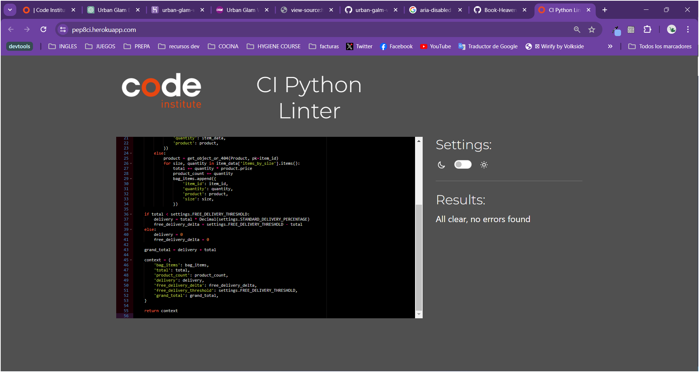
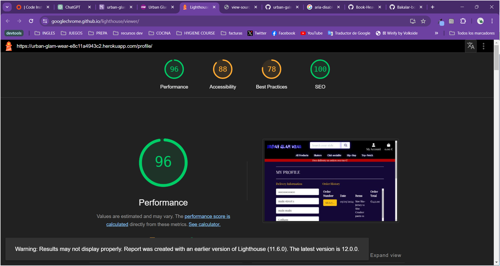

go back to [README.md](/README.md)

# Testing
- [Code Validation](#code-validation)
    - [HTML](#html)
    - [CSS](#css)
    - [JavaScript](#javascript)
    - [Python](#python)
- [Accesibility](#accesibility)
- [Tools Testing](#tools-testing)
- [Manual Testing](#manual-testing)
    - [Browser Compatibility](#browser-compatibility)
    - [Navbar Testing](#navbar-testing)
    - [Footer Testing](#footer-testing)
    - [Search Bar Testing](#search-bar-testing)
    - [Product Page Testing](#product-page-testing)
    - [Product Detail Page Testing](#product-detail-page-testing)
    - [Bag Testing](#bag-testing)
    - [Checkout Page Testing](#checkout-page-testing)
    - [Contact Us Page Testing](#contact-us-page-testing)
    - [Privacy Policy Page Testing](#privacy-policy-page-testing)
    - [404 Page Testing](#404-page-testing)
    - [Register Page Testing](#register-page-testing)
    - [Login Page Testing](#login-page-testing)
    - [Logout Page Testing](#logout-page-testing)
    - [Product Management Page Testing](#product-management-page-testing)
    - [Wishlist Page Testing](#wishlist-page-testing)

## Code Validation
### HTML

|Page|Validator|Result|
| --- | --- | --- |
| Home Page |  | <mark>Pass<mark> |
| Register Page |  | <mark>Pass<mark> |
| My Profile Page |  | <mark>Pass<mark> |
| Login Page |  | <mark>Pass<mark> |
| Logout Page |  | <mark>Pass<mark> |
| Wishlist Page |  | <mark>Pass<mark> |
| Product Management Page |  | <mark>Pass<mark> |
| Products Page |  | <mark>Pass<mark> |
| Product Details Page |  | <mark>Pass<mark> |
| Bag Page |  | <mark>Pass<mark> |
| Checkout Page |  | <mark>Pass<mark> |
| Checkout Success Page |  | <mark>Pass<mark> |
| Contact Us Page |  | <mark>Pass<mark> |
| About Us Page |  | <mark>Pass<mark> |
| Privacy Policy Page |  | <mark>Pass<mark> |
| 404 Page |  | <mark>Pass<mark> |

### CSS

|File|Validator|Result|
| --- | --- | --- |
| base.css |  | <mark>Pass<mark> |
| checkout.css |  | <mark>Pass<mark> |
| profile.css |  | <mark>Pass<mark> |

### JavaScript

|File|Validator|Result|Comments|
| --- | --- | --- | --- |
| stripe_elements.js |  | <mark>Pass<mark> | Two undefined variables |
| countryfield.js |  | <mark>Pass<mark> | One undefined variables |

### Python

|File|App|Validator|Result|Comments|
| --- | --- | --- | --- | --- |
| apps.py | Bag |  | <mark>Pass<mark> | |
| contexts.py | Bag |  | <mark>Pass<mark> | |
| urls.py | Bag |  | <mark>Pass<mark> | |
| views.py | Bag |  | <mark>Pass<mark> | |
| admin.py | Checkout |  | <mark>Pass<mark> | |
| apps.py | Checkout | | <mark>Pass<mark> | |
| forms.py | Checkout | | <mark>Pass<mark> | |
| models.py | Checkout | | <mark>Pass<mark> | |
| signals.py | Checkout | | <mark>Pass<mark> | |
| urls.py | Checkout | | <mark>Pass<mark> | |
| views.py | Checkout | | <mark>Pass<mark> | File 80 to long: not possible to fix the line |
| admin.py | Home | | <mark>Pass<mark> | |
| apps.py | Home | | <mark>Pass<mark> | |
| forms.py | Home | | <mark>Pass<mark> | |
| models.py | Home | | <mark>Pass<mark> | |
| urls.py | Home | | <mark>Pass<mark> | |
| views.py | Home | | <mark>Pass<mark> | |
| admin.py | Newsletter | | <mark>Pass<mark> | |
| apps.py | Newsletter | | <mark>Pass<mark> | |
| forms.py | Newsletter | | <mark>Pass<mark> | |
| models.py | Newsletter | | <mark>Pass<mark> | |
| urls.py | Newsletter | | <mark>Pass<mark> | |
| views.py | Newsletter | | <mark>Pass<mark> | |
| admin.py | Products | | <mark>Pass<mark> | |
| apps.py | Products | | <mark>Pass<mark> | |
| forms.py | Products | | <mark>Pass<mark> | |
| models.py | Products | | <mark>Pass<mark> | |
| urls.py | Products | | <mark>Pass<mark> | |
| views.py | Products | | <mark>Pass<mark> | |
| widgets.py | Products | | <mark>Pass<mark> | line 9 too long |
| apps.py | Profiles | | <mark>Pass<mark> | |
| forms.py | Profiles | | <mark>Pass<mark> | |
| models.py | Profiles | | <mark>Pass<mark> | |
| urls.py | Profiles | | <mark>Pass<mark> | |
| views.py | Profiles | | <mark>Pass<mark> | |
| settings.py | urban_glam_wear | | <mark>Pass<mark> | 31, 86, 146, 149, 152, 155 lines too long |
| urls.py | urban_glam_wear | | <mark>Pass<mark> | |
| views.py | urban_glam_wear | | <mark>Pass<mark> | |
| apps.py | Wishlist | | <mark>Pass<mark> | |
| urls.py | Wishlist | | <mark>Pass<mark> | |
| views.py | Wisklist | | <mark>Pass<mark> | 

## Accesibility

|PAge|Lighthouse Report|
| --- | --- |
| Home | |
| Registration | |
| My Profile | |
| Login | |
| Logout | |
| Wishlist | |
| Product management | |
| Products | |
| Product Details | |
| Bag | |
| Checkout | |
| Checkout-success | |
| Contact Us | |
| About Us | |
| Privacy Policy | |
| 404 | |

## Tools Testing

[Chrome DevTools](https://developer.chrome.com/docs/devtools/)

Chrome DevTools was used during the development process to test, explore and modify HTML elements and CSS styles used in the project.

## Manual Testing

### Browser Compatibility

Browser | Outcome | Pass/Fail |
--- | --- | --- |
Google Chrome | No appearance, responsiveness nor functionality issues.| <mark>Pass<mark> |
Safari | No appearance, responsiveness nor functionality issues. | <mark>Pass<mark> |
Mozilla Firefox | No responsiveness nor functionality issues.| <mark>Pass<mark> |
Microsoft Edge | No appearance, responsiveness nor functionality issues. | <mark>Pass<mark> |

